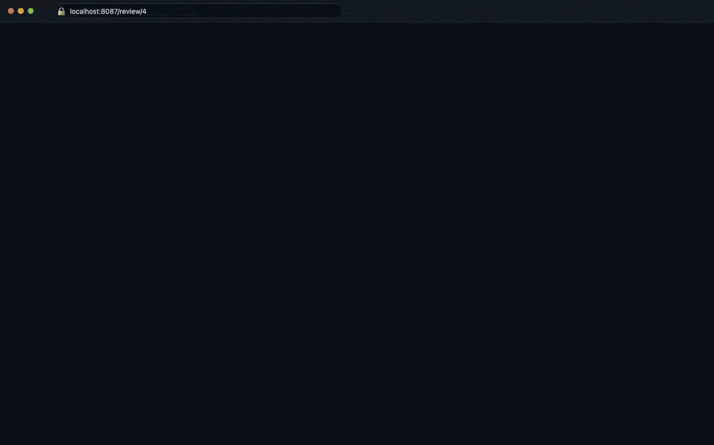
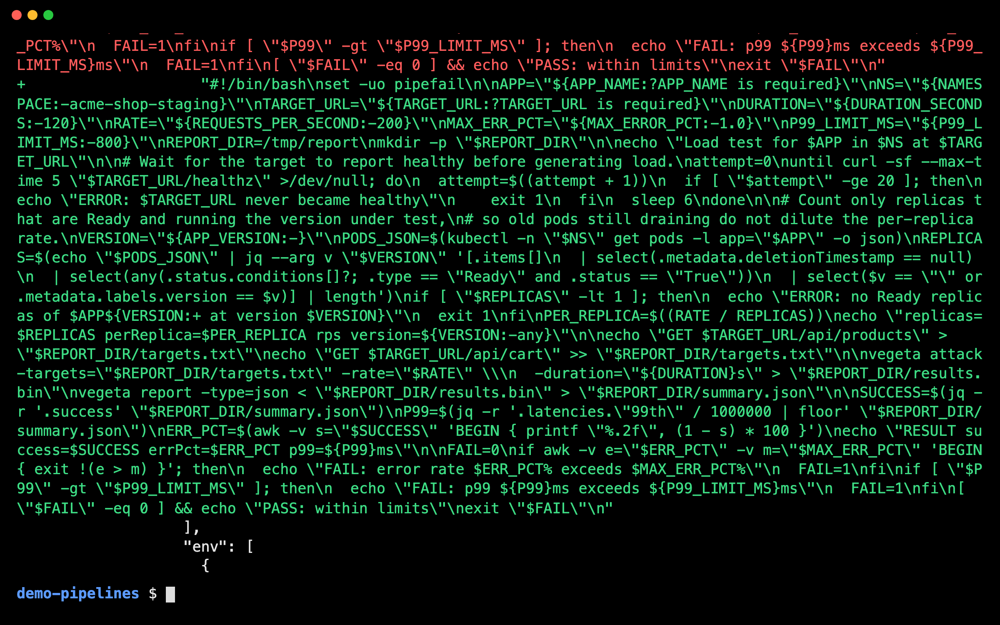
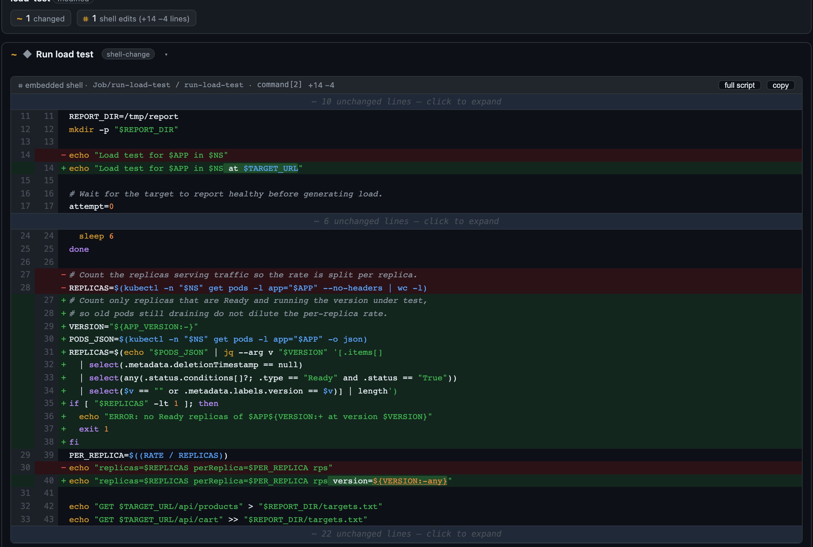

# session-review

A local GitHub-style diff viewer for your branches and pull requests, with rendered [Spinnaker pipeline](#spinnaker-pipelines) and markdown diffs, [Inline / Split / Traditional views](#code-views), Claude's session notes (💬) and Ask Claude.

## Usage

In Claude Code, from a repo under `~/Documents`:

| Command | Reviews |
|---|---|
| `/review-ui` | the current branch vs the default branch |
| `/review-ui https://github.com/acme/app/pull/42` | a pull request, by link |
| `/review-ui 42` | a pull request of the current repo |
| `/review-ui feature-xyz` | another branch |
| `/review-ui --base develop` | the current branch vs a different base |
| `/review-ui feature-a..feature-b` | the changes in `feature-b` since `feature-a` |

Or just ask: "show me the review of PR 42".

Git worktrees work too, including Claude Code's `.claude/worktrees/`.

## Install

Requires Docker, Claude Code, python3 and curl. PR links need `gh` logged in to that host.

```
/plugin marketplace add lemony312/session-review
/plugin install session-review@session-review
```

Then restart Claude Code. As a plugin the command is namespaced: type `/session-review:review-ui` (or `/review-ui` if nothing else uses that name). Asking "show me the review of …" also triggers it. The review database lives in `~/.local/share/session-review`, so it survives plugin updates.

Alternatively, clone and link the skill into `~/.claude/skills/` so it is plain `/review-ui`:

```bash
git clone https://github.com/lemony312/session-review.git ~/Documents/session-review
~/Documents/session-review/install.sh
```

Either way the skill starts the server (http://localhost:8087) itself whenever it is down.

## Spinnaker pipelines



This change edits a shell script embedded in a pipeline. Git sees one line of escaped JSON (**+1 −1**):



`/review-ui` finds the stage that changed and diffs its script as shell (**+14 −4**):



## Code views

Markdown renders as markdown with changed words highlighted; code shows **Inline** (default) with the same highlighting. **Split** and **Traditional** are one click away.


## Configuration

Only needed if you don't use the defaults. Set these in your shell profile, then restart the server (see below).

| Variable | Default | Set it when |
|---|---|---|
| `SESSION_REVIEW_HOME` | `~/Documents/session-review` | you cloned somewhere else |
| `REPOS_HOST_DIR` | `~/Documents` | your repos live somewhere else |
| `SESSION_REVIEW_PORT` | `8087` | the port is taken |
| `PIPELINE_IMAGE_REGISTRY_PREFIXES` | unset | you want pipeline images outside your approved registries flagged (comma-separated prefixes) |

All settings, including Ask with other agents: [docs/DEVELOPMENT.md](docs/DEVELOPMENT.md#configuration).

## Without Claude Code

```bash
~/Documents/session-review/scripts/session-review-health.sh   # start the server if it is down
curl -sG -X POST http://localhost:8087/api/reviews/generate-branch \
  --data-urlencode "repo_path=$HOME/Documents/<repo>" \
  --data-urlencode "branch=<branch>" --data-urlencode "base_ref=origin/main"
open http://localhost:8087/review/<review_id>
```

## Troubleshooting

`/review-ui` starts the server when it is down, so normally there is nothing to run. These cover the rest:

```bash
cd ~/Documents/session-review
git pull && scripts/session-review-health.sh --rebuild                       # after updating (the running build isn't replaced otherwise)
scripts/session-review-health.sh --stop && scripts/session-review-health.sh  # after changing a setting
scripts/session-review-health.sh --logs                                      # server logs
```

More: [docs/DEVELOPMENT.md](docs/DEVELOPMENT.md).

## Support

Open an issue at [lemony312/session-review](https://github.com/lemony312/session-review/issues).
